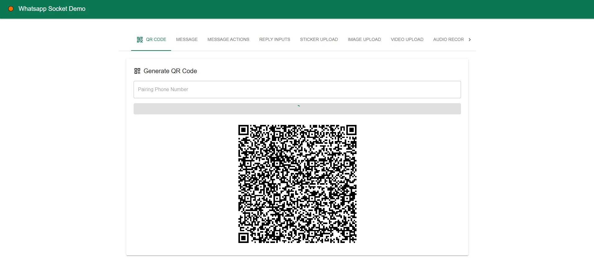

# [@hdriel/whatsapp-socket](https://www.npmjs.com/package/@hdriel/whatsapp-socket)

A TypeScript/JavaScript wrapper library for WhatsApp Web Socket communication, built on top of [@fadzzzslebew/baileys](https://github.com/fadzzzslebew/baileys). This package provides a simplified, high-level API for interacting with WhatsApp Web with support for multi-device connections.

## ⚠️ Disclaimer

This project is not affiliated, associated, authorized, endorsed by, or in any way officially connected with WhatsApp or any of its subsidiaries or affiliates. The official WhatsApp website can be found at [https://whatsapp.com](https://whatsapp.com). "WhatsApp" as well as related names, marks, emblems and images are registered trademarks of their respective owners.

**Use at your own risk.** WhatsApp does not allow bots or unofficial clients on their platform. Using this library may result in your WhatsApp account being banned.

## Features

- 🚀 WebSocket-based communication with WhatsApp Web (powered by Baileys)
- 📱 QR code authentication or pairing code authentication
- 💬 Send text messages
- 🔗 Send interactive button messages (URL, call, copy, ~~email~~, ~~reminder~~)
- 🔂 Send reply buttons messages
- 🖼️ Send images with captions
- 🎥 Send videos
- 🎵 Send audio messages
- 📄 Send documents/files
- 🎨 Send stickers (WebP format, up to 5MB)
- 💾 Session persistence (file-based or MongoDB)
- 🔂 Singleton instances to prevent multiple connection for same WhatsApp Web token (by one of props: appName/pairingPhone/mongoCollection/fileAuthStateDirectoryPath)
- 📝 Full TypeScript support
- 🎬 FULL DEMO SERVER & CLIENT: [github repo](https://github.com/hdriel/whatsapp-socket)

[//]: # (  - demo-client directory run ```npm run build```)

  - demo-server directory run ```npm start```
  - open browser ```http://localhost:1010```
  
    

## ⚠️ Important: Server Requirements

**This service MUST run on a persistent server (e.g., VPS, dedicated server, or container) and NOT on serverless platforms like AWS Lambda, Google Cloud Functions, or Vercel Serverless Functions.**

The WhatsApp socket connection requires a persistent, stateful connection that stays alive and maintains session state. Serverless functions:
- Have short execution timeouts (typically 15-900 seconds)
- Cannot maintain long-lived WebSocket connections
- Restart frequently, losing connection state
- Will cause multiple connection attempts, which WhatsApp may flag as suspicious behavior

**Recommended hosting options:**
- VPS (DigitalOcean, Linode, Vultr)
- Dedicated servers
- Docker containers on persistent infrastructure
- AWS EC2/ECS, Google Compute Engine, or Azure VM (not Lambda/Cloud Functions)


## Installation

```bash
npm install @hdriel/whatsapp-socket
```

or

```bash
yarn add @hdriel/whatsapp-socket
```

For MongoDB session storage (optional):

```bash
npm install mongodb
```

## Quick Start

```typescript
import { WhatsappSocket } from '@hdriel/whatsapp-socket';
import path from 'path';

const client = new WhatsappSocket({
  // File-based session storage (recommended for development)
  fileAuthStateDirectoryPath: path.resolve(__dirname, './authState/my-profile'),
  
  // Or use MongoDB for production (optional)
  // mongoURL: 'mongodb://localhost:27017/whatsapp-sessions-app',
    
  // logger, // Custom logger (npm stack-trace-logger) instance (optional)
  
  // Print QR code in terminal
  printQRInTerminal: true,
  
  // Enable debug mode
  debug: true,

   // When failed to connecting before sending messages
  onPreConnectionSendMessageFailed: (error: Error) => {...}

   // Connection status callback 
  onConnectionStatusChange: (status: 'open' | 'close' | 'connecting') => {
    console.log('Connection status:', status);
  },
  
  // QR code callback
  onQR: async (qr, qrCode) => {
    console.log('QR Code received');
    // Convert QR string to image
    const qrImage = await WhatsappSocket.qrToImage(qr);
    // Display qrImage to user for scanning
  },
  
  // Connection opened
  onOpen: async () => {
    console.log('WhatsApp connection opened!');
  },
  
  // Connection closed
  onClose: async () => {
    console.log('WhatsApp connection closed');
  }
});

// Start the connection
await client.startConnection();

// Check if connected
if (client.isConnected()) {
  // Send a text message
  await client.sendTextMessage('050-000-0000', 'Hello World!');
}
```

## API Reference

### Connection Management

#### `startConnection()`
Start the WhatsApp connection. This will trigger QR code generation if not authenticated.

```typescript
await client.startConnection();
```

#### `closeConnection()`
Close the WhatsApp connection.

```typescript
await client.closeConnection();
```

#### `resetConnection(options?)`
Reset the connection and generate a new QR code or use phone pairing.

```typescript
// Generate new QR code
await client.resetConnection();

// Or use phone number pairing
await client.resetConnection({ pairingPhone: '050-000-0000' });
```

#### `isConnected()`
Check if the client is currently connected.

```typescript
const connected = client.isConnected();
console.log('Connected:', connected);
```

### Messaging Methods

#### `sendTextMessage(jid, text)`
Send a plain text message.

```typescript
await client.sendTextMessage(
  '0500000000',// or 050-000-0000 converted to 972500000000 , or define DEFAULT_COUNTRY to change 972 to your country 
  'Hello, this is a test message!'
);
```

#### `sendButtonsMessage(jid, options)`
Send an interactive message with action buttons.

```typescript
await client.sendButtonsMessage('1234567890@s.whatsapp.net', {
  title: 'Welcome to our service!',
  subtitle: 'Please choose an action below',
  buttons: [
    { label: 'Visit Website', url: 'https://example.com' },
    { label: 'Call Us', tel: '050-123-4567' },
    { label: 'Copy Code', copy: 'PROMO2024' },
    // { label: 'Email Us', email: 'support@example.com' }, // not supported
    // not supported  
    // {  
    //   label: 'Set Reminder',  
    //   reminderName: 'Follow up call',
    //   reminderOn: '20m' // or use reminderDate
    // }
  ]
});
```

#### `sendReplyButtonsMessage(jid, options)`
Send a message with reply buttons (quick reply options).

```typescript
await client.sendReplyButtonsMessage('1234567890@s.whatsapp.net', {
  title: 'Choose your preferred time',
  subtitle: 'Click one of the options below',
  buttons: [
      'Morning (9-12)',
      'Afternoon (12-5)',
      'Evening (5-9)'
  ]
});
```

#### `sendImageMessage(jid, buffer, options?)`
Send an image message.

```typescript
import fs from 'fs';

const imageBuffer = fs.readFileSync('./photo.jpg');
await client.sendImageMessage('050-000-0000', imageBuffer, {
  caption: 'Check out this photo!',
  filename: 'photo.jpg'
});
```

#### `sendVideoMessage(jid, buffer, caption?)`
Send a video message.

```typescript
const videoBuffer = fs.readFileSync('./video.mp4');
await client.sendVideoMessage(
  '050-000-0000',
  videoBuffer,
  { caption: 'Amazing video!' }
);
```

#### `sendAudioMessage(jid, buffer, options?)`
Send an audio message.

```typescript
const audioBuffer = fs.readFileSync('./audio.mp3');
await client.sendAudioMessage('050-000-0000', audioBuffer, {
  filename: 'audio.mp3',
  mimetype: 'audio/mpeg'
});
```

#### `sendFileMessage(jid, buffer, options?)`
Send a document/file message.

```typescript
const fileBuffer = fs.readFileSync('./document.pdf');
await client.sendFileMessage('050-000-0000', fileBuffer, {
  filename: 'document.pdf',
  mimetype: 'application/pdf',
  caption: 'Here is the requested document'
});
```

#### `sendStickerMessage(jid, buffer)`
Send a sticker message (must be WebP format).

```typescript
const stickerBuffer = fs.readFileSync('./sticker.webp');
await client.sendStickerMessage('050-000-0000', stickerBuffer);
```

### Utility Methods

#### `WhatsappSocket.qrToImage(qr)`
Convert QR code string to base64 image.

```typescript
const qrImage = await WhatsappSocket.qrToImage(qrString);
console.log(qrImage); // data:image/png;base64,...
// In client side 
```

#### `WhatsappSocket.randomPairingCode(pattern)`
Generate a random pairing code.

```typescript
// Generate 6-digit numeric code
const code = WhatsappSocket.randomPairingCode('[0-9]');

// Generate alphanumeric code
const alphaCode = WhatsappSocket.randomPairingCode('[a-z0-9]');
```

## Phone Number Format

Support normal format and converters to expected format for example:
- Individual chats: 050-111-2222 || 0501112222 => `972501112222@s.whatsapp.net`
- Group chats: Not handle yet group chats implementations

Note: WhatsApp uses JID (Jabber ID) format for phone numbers
- Individual chats: `{phone_number}@s.whatsapp.net`
- Group chats: `{group_id}@g.us`

# Default Country Code

Changing the default country code it using on the static field like:
```typescript
WhatsappSocket.DEFAULT_COUNTRY_CODE = '510';
```

## Complete Express.js Example

Here's a complete example of an Express.js server with Socket.IO integration:

```typescript
import express from 'express';
import http from 'http';
import { Server as SocketIO } from 'socket.io';
import { WhatsappSocket } from '@hdriel/whatsapp-socket';
import path from 'path';

const app = express();
const server = http.createServer(app);
const io = new SocketIO(server);

app.use(express.json());

// Initialize WhatsApp client
const client = new WhatsappSocket({
  fileAuthStateDirectoryPath: path.resolve(__dirname, './authState/my-profile-data'),
  printQRInTerminal: true,
  debug: true,
  onConnectionStatusChange: (status) => {
    io.emit('connection-status', status);
  },
  onQR: async (qr, qrCode) => {
    const qrImage = await WhatsappSocket.qrToImage(qr);
    io.emit('qr', { qrImage, qrCode });
  },
  onOpen: () => io.emit('qr-connected'),
  onClose: () => io.emit('qr-disconnected')
});

// Start connection on server start
client.startConnection();

// Socket.IO connection
io.on('connection', (socket) => {
  console.log('Client connected');
  socket.emit('connected');
});

// API Routes
app.post('/api/connect', async (req, res) => {
  await client.startConnection();
  res.json({ message: 'OK' });
});

app.post('/api/disconnect', async (req, res) => {
  await client.closeConnection();
  res.json({ message: 'OK' });
});

app.post('/api/generate-qr', async (req, res) => {
  const { phone } = req.body;
  await client.resetConnection({ pairingPhone: phone });
  res.json({ message: 'OK' });
});

app.post('/api/send-message', async (req, res) => {
  const { phoneTo, message } = req.body;
  await client.sendTextMessage(phoneTo, message);
  res.json({ message: 'OK' });
});

app.post('/api/send-buttons', async (req, res) => {
  const { phoneTo, title, subtitle, buttons } = req.body;
  await client.sendButtonsMessage(phoneTo, { title, subtitle, buttons });
  res.json({ message: 'OK' });
});

server.listen(3000, () => {
  console.log('Server running on port 3000');
});
```

## File Upload Example with Multer

```typescript
import multer from 'multer';
import bytes from 'bytes';

const storage = multer.memoryStorage();

const uploadImage = multer({
  storage,
  limits: { fileSize: bytes('50MB') },
  fileFilter: (req, file, cb) => {
    if (file.mimetype.startsWith('image/')) {
      cb(null, true);
    } else {
      cb(new Error('Only image files are allowed'));
    }
  }
});

app.post('/api/upload-image', uploadImage.single('image'), async (req, res) => {
  const imageFile = req.file;
  if (!imageFile) {
    return res.status(400).json({ message: 'No image file provided' });
  }

  const { phoneTo, caption } = req.body;
  await client.sendImageMessage(phoneTo, imageFile.buffer, {
    caption,
    filename: imageFile.originalname
  });

  res.json({ message: 'OK' });
});
```

# Group Management

The library provides comprehensive group management capabilities through the `WhatsappSocketGroup` class.

## Quick Start with Groups

```typescript
import { WhatsappSocketGroup } from '@hdriel/whatsapp-socket';

const client = new WhatsappSocketGroup({
  fileAuthStateDirectoryPath: './authState/my-profile',
  printQRInTerminal: true,
  debug: true
});

await client.startConnection();
```

## Group Operations

### Creating Groups

```typescript
// Create a new group
const group = await client.createGroup({
  name: 'My Test Group',
  description: 'This is a test group', // optional
  participants: ['972501234567', '972507654321'] // optional, can be empty
});

console.log('Group ID:', group.id);
```

### Group Information

```typescript
// Update group name
await client.updateGroupName(groupId, 'New Group Name');

// Update group description
await client.updateGroupDescription(groupId, 'New description text');

// Get group metadata
const metadata = await client.getGroupMetadata(groupId);
console.log('Group Name:', metadata.subject);
console.log('Participants:', metadata.participants.length);

// Get all groups
const allGroups = await client.getAllGroups();
console.log('Total groups:', allGroups.length);
```

### Group Settings

```typescript
// Lock group (only admins can send messages)
await client.updateGroupSettings(groupId, 'announcement');

// Unlock group (everyone can send messages)
await client.updateGroupSettings(groupId, 'not_announcement');

// Lock group info (only admins can edit)
await client.updateGroupSettings(groupId, 'locked');

// Unlock group info (everyone can edit)
await client.updateGroupSettings(groupId, 'unlocked');
```

### Participant Management

```typescript
// Add participants
await client.addParticipants(groupId, '972501234567');
// Or add multiple
await client.addParticipants(groupId, ['972501234567', '972507654321']);

// Remove participants
await client.removeParticipants(groupId, '972501234567');

// Promote to admin
await client.promoteToAdmin(groupId, '972501234567');

// Demote from admin
await client.demoteFromAdmin(groupId, '972501234567');

// Leave group
await client.leaveGroup(groupId);
```

### Invite Management

```typescript
// Get group invite code
const inviteCode = await client.getGroupInviteCode(groupId);
const inviteLink = await client.getGroupInviteCode(groupId, true);  
console.log('Invite link:', inviteLink); // `https://chat.whatsapp.com/${inviteCode}`;

// Get group info from invite code
const groupInfo = await client.getGroupInfoFromInvite(inviteCode);
console.log('Group name:', groupInfo.subject);

// Revoke invite code (generates new one)
const newInviteCode = await client.revokeGroupInviteCode(groupId);
console.log('New invite code:', newInviteCode);

// Join group via invite code
const joinedGroupId = await client.joinGroupViaInvite(inviteCode);
```

### Profile Picture Management

**Note:** Requires `sharp` library to be installed:
```bash
npm install sharp
```

```typescript
import fs from 'fs';

// Update group profile picture
const imageBuffer = fs.readFileSync('./group-photo.jpg');
await client.updateGroupProfilePicture(groupId, imageBuffer);

// Get profile picture URL (preview/low-res)
const previewUrl = await client.getGroupProfilePicture(groupId, false);

// Get profile picture URL (high-res)
const highResUrl = await client.getGroupProfilePicture(groupId, true);

// Remove profile picture
await client.removeGroupProfilePicture(groupId);
```

### Sending Messages to Groups

All messaging methods work the same for groups and individual chats:

```typescript
// Send text message to group
await client.sendTextMessage(groupId, 'Hello everyone!');

// Send message with mention all
await client.sendMentionAll(groupId, '📢 Important announcement!');

// Send buttons message
await client.sendButtonsMessage(groupId, {
  title: 'Group Poll',
  subtitle: 'Vote for next event',
  buttons: [
    { label: 'Visit Website', url: 'https://example.com' },
    { label: 'Copy Code', copy: 'EVENT2024' }
  ]
});

// Send reply buttons
await client.sendReplyButtonsMessage(groupId, {
  title: 'Quick poll',
  subtitle: 'Choose your answer',
  buttons: ['Option 1', 'Option 2', 'Option 3']
});

// Send media
const imageBuffer = fs.readFileSync('./photo.jpg');
await client.sendImageMessage(groupId, imageBuffer, {
  caption: 'Group photo!'
});
```

## Complete Group Example

```typescript
import { WhatsappSocketGroup } from '@hdriel/whatsapp-socket';
import fs from 'fs';

async function groupExample() {
  const client = new WhatsappSocketGroup({
    fileAuthStateDirectoryPath: './authState',
    printQRInTerminal: true,
    debug: true
  });

  await client.startConnection();

  // Create group
  const group = await client.createGroup({
    name: '🎉 My Awesome Group',
    description: 'Welcome to our group!',
    participants: ['0501234567']
  });

  const groupId = group.id;

  // Get invite link
  const inviteCode = await client.getGroupInviteCode(groupId);
  const inviteLink = await client.getGroupInviteCode(groupId, true);
  // https://chat.whatsapp.com/${inviteCode}

  // Send welcome message with invite link
  await client.sendTextMessage(
    groupId,
    `Welcome! 🎉\n\nInvite link: ${inviteLink}`
  );

  // Set group profile picture
  const imageBuffer = fs.readFileSync('./group-icon.jpg');
  await client.updateGroupProfilePicture(groupId, imageBuffer);

  // Lock group (only admins can send)
  await client.updateGroupSettings(groupId, 'announcement');

  // Add more participants
  await client.addParticipants(groupId, ['0507654321', '972509876543']);

  // Promote someone to admin
  await client.promoteToAdmin(groupId, '0507654321');

  // Send announcement
  await client.sendMentionAll(
    groupId,
    '📢 Group is now set up! Only admins can send messages.'
  );
  
  // And all the function of the private message also here, sendButtons and so on..

  // Get group info
  const metadata = await client.getGroupMetadata(groupId);
  console.log(`Group "${metadata.subject}" has ${metadata.participants.length} members`);
}

groupExample().catch(console.error);
```

## Group ID Format

- Individual chats: `{phone}@s.whatsapp.net`
- **Group chats: `{group_id}@g.us`**

The library automatically formats group IDs, so you can use either:
```typescript
await client.updateGroupName('123456789@g.us', 'New Name');
// or
await client.updateGroupName('123456789', 'New Name'); // automatically adds @g.us
```

## Helper Methods

```typescript
// Check if a JID is a group
const isGroup = WhatsappSocketGroup.isGroupId(jid);

// Format phone number to WhatsApp pattern
const formattedPhone = WhatsappSocketGroup.formatPhoneNumberToWhatsappPattern('050-123-4567');
// Returns: '972501234567@s.whatsapp.net'

// Format group ID
const formattedGroupId = WhatsappSocketGroup.formatGroupId('123456789');
// Returns: '123456789@g.us'
```

## Error Handling

Always wrap group operations in try-catch blocks:

```typescript
try {
  await client.addParticipants(groupId, phoneNumber);
} catch (error) {
  console.error('Failed to add participant:', error);
  
  if (error.message.includes('item-not-found')) {
    console.log('Group or participant not found');
  } else if (error.message.includes('not-authorized')) {
    console.log('Bot is not an admin');
  }
}
```

## Common Use Cases

### Auto-Welcome New Members

```typescript
client.onReceiveMessages = async (messages) => {
  for (const msg of messages) {
    if (msg.messageType === 'groupParticipantsUpdate') {
      const groupId = msg.key.remoteJid;
      await client.sendTextMessage(
        groupId,
        'Welcome to the group! 👋'
      );
    }
  }
};
```

### Daily Announcements

```typescript
import cron from 'node-cron';

// Send daily message at 9 AM
cron.schedule('0 9 * * *', async () => {
  await client.sendMentionAll(
    groupId,
    '☀️ Good morning everyone! Have a great day!'
  );
});
```

### Group Polling System

```typescript
await client.sendReplyButtonsMessage(groupId, {
  title: '📊 Daily Poll',
  subtitle: 'What should we have for lunch?',
  buttons: ['🍕 Pizza', '🍔 Burgers', '🍜 Ramen', '🥗 Salad']
});
```

## Best Practices

1. **Admin Rights**: Many operations require admin rights. Ensure your bot is an admin before performing administrative tasks.

2. **Rate Limiting**: Don't add/remove participants too quickly. Add delays between operations:
   ```typescript
   await client.addParticipants(groupId, participant1);
   await new Promise(resolve => setTimeout(resolve, 2000)); // 2 second delay
   await client.addParticipants(groupId, participant2);
   ```

3. **Profile Pictures**: Install `sharp` for better performance:
   ```bash
   npm install sharp
   ```

4. **Group Size**: WhatsApp has limits on group sizes (typically 1024 members). Check before adding participants.

5. **Permissions**: Always check if the bot has necessary permissions before performing admin actions.

---

**See also**: [Complete Demo Script](https://github.com/hdriel/whatsapp-socket/blob/main/demo-script/src/group.script.ts)

## Session Storage

### File-Based Storage (Recommended for Development)

```typescript
const client = new WhatsappSocket({
  fileAuthStateDirectoryPath: path.resolve(__dirname, './authState/my-profile')
});
```

Session files will be stored in the specified directory and automatically loaded on subsequent connections.

### MongoDB Storage (Recommended for Production)

```typescript
const client = new WhatsappSocket({
  mongoURL: 'mongodb://localhost:27017/whatsapp-sessions'
});
```

For MongoDB storage, install the peer dependency:
```bash
npm install mongodb
```

## Known Issues
* not supported image formats: svg, gif, bmp
* issues to send large videos
* peering phone not working

## Best Practices

1. **Session Management**: Always store session data securely. For production, use MongoDB or encrypted file storage.

2. **Rate Limiting**: Implement rate limiting to avoid sending too many messages in a short period, which could result in being banned.

3. **Error Handling**: Always wrap API calls in try-catch blocks:
   ```typescript
   try {
     await client.sendTextMessage(jid, message);
   } catch (error) {
     console.error('Failed to send message:', error);
   }
   ```
4. **Testing**: Test with a secondary phone number before using with your primary account

## TypeScript Support

The library is written in TypeScript and includes complete type definitions:

```typescript
import { WhatsappSocket } from '@hdriel/whatsapp-socket';

// All methods and options are fully typed
const client: WhatsappSocket = new WhatsappSocket({
  fileAuthStateDirectoryPath: './authState',
  debug: true
});
```

## Troubleshooting

### QR Code Not Generating
- Ensure `printQRInTerminal` is set to `true` or handle the `onQR` callback
- Check that the session directory has write permissions
- Try calling `resetConnection()` to generate a new QR code

### Connection Keeps Dropping
- Check your internet connection
- Verify that session data is being saved correctly
- Ensure MongoDB is accessible if using MongoDB storage
- Check WhatsApp Web's status (sometimes WhatsApp blocks certain IPs)

### Messages Not Sending
- Verify the phone number format / default country set correctly
- Check if the number is registered on WhatsApp
- Ensure the connection is active using `isConnected()`
- Check for rate limiting

## Contributing

Contributions are welcome! Please feel free to submit a Pull Request.

1. Fork the repository
2. Create your feature branch (`git checkout -b feature/amazing-feature`)
3. Commit your changes (`git commit -m 'Add some amazing feature'`)
4. Push to the branch (`git push origin feature/amazing-feature`)
5. Open a Pull Request

## License

MIT License - see the [LICENSE](LICENSE) file for details.

## Dependencies

- [@fadzzzslebew/baileys](https://github.com/fadzzzslebew/baileys) - Core WhatsApp Web API
- [qrcode](https://www.npmjs.com/package/qrcode) - QR code generation
- [pino](https://www.npmjs.com/package/pino) - Logging
- [music-metadata](https://www.npmjs.com/package/music-metadata) - Audio metadata extraction
- [ms](https://www.npmjs.com/package/ms) - Time string parsing

## Author

**Hadriel Benjo**
- GitHub: [@hdriel](https://github.com/hdriel)
- LinkedIn: [Hadriel Benjo](https://www.linkedin.com/in/hadriel-benjo/)
- YouTube: [@Just-Like-That](https://www.youtube.com/@Just-Like-That./playlists)

---

**Remember**: This is an unofficial library. Use responsibly and at your own risk. Always respect WhatsApp's Terms of Service.

## 🔗 Links
- [GitHub fadzzzslebew/Baileys](https://github.com/fadzzzslebew/baileys/tree/main)
- [GitHub Demo Repository](https://github.com/hdriel/whatsapp-socket) 
- [@hdriel/whatsapp-socket npm package](https://www.npmjs.com/package/@hdriel/whatsapp-socket) 
- [Automating WhatsApp](https://medium.com/@elvisbrazil/automating-whatsapp-with-node-js-and-baileys-send-receive-and-broadcast-messages-with-code-0656c40bd928)

---

Made with ❤️ for developers who want powerful Whatsapp Bot utilities without the complexity,<br/> 
⭐ me on GitHub
